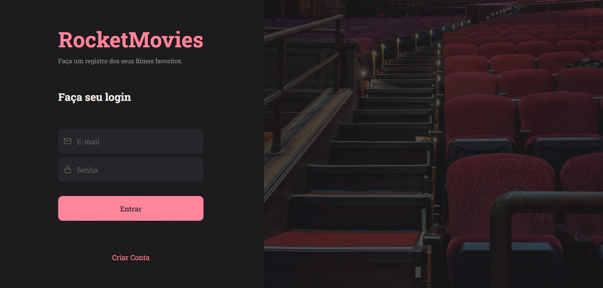
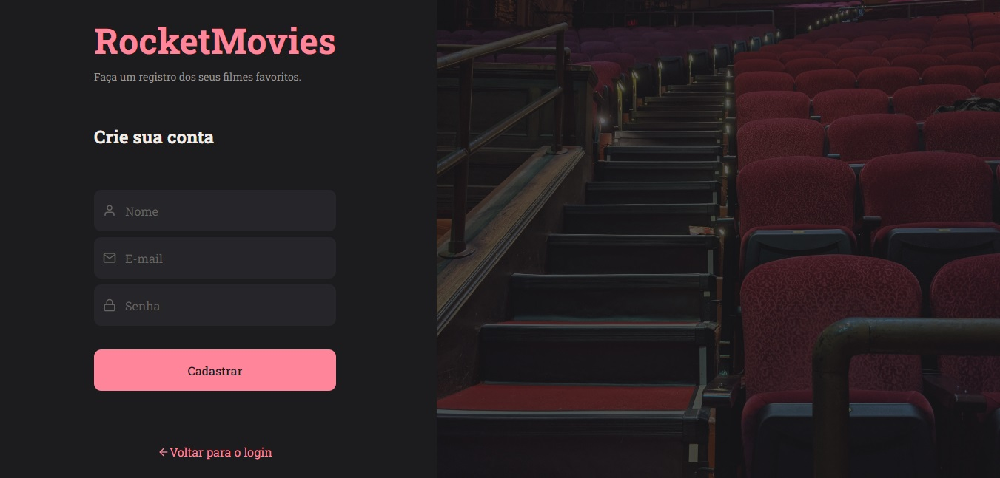

<h1 align="center"> Stage 08 - RocketMovies</h1>

  <a href="#-tecnologias">Tecnologias</a>&nbsp;&nbsp;&nbsp;|&nbsp;&nbsp;&nbsp;
  <a href="https://github.com/gabriel-adsv/stage08-rocketmovies">Projeto</a>&nbsp;&nbsp;&nbsp;|&nbsp;&nbsp;&nbsp;
  <a href="https://stage08-rocketmovies.vercel.app/" target="_blank">Layout</a>&nbsp;&nbsp;&nbsp;|&nbsp;&nbsp;&nbsp;
  <a href="#memo-licença">Licença</a>

  

<strong>Projeto desenvolvido no nível 8 das aulas da trilha Explorer da Rocketseat.</strong> 
Neste desafio, foi proposto a criação de uma aplicação para registros de filmes em Node.js.

 

  

  

## 🚀 Tecnologias
Esse projeto foi desenvolvido com as seguintes tecnologias:
- HTML
- CSS
- JavaScript
- React
- Node.js

## 💻 Projeto
Atividade feita no Stage 08 do curso Explorer da Rocketseat. Onde é feito uma página de registros de filme com utilizando node.js no backend.

- [Acesse o projeto finalizado, online](https://github.com/gabriel-adsv/stage08-rocketmovies)

## 📧 Contato
- gabriel.aug.dsv@gmail.com

## 📝 Licença
Esse projeto está sob a licença MIT.

---
Desenvolvido por Gabriel Augusto